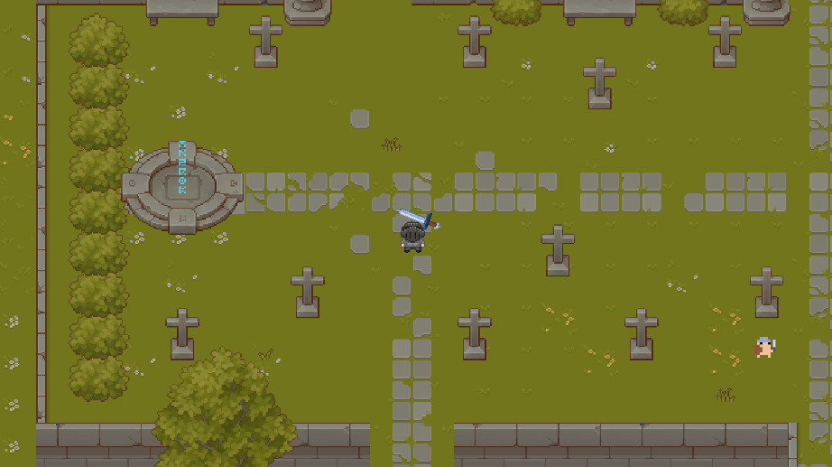
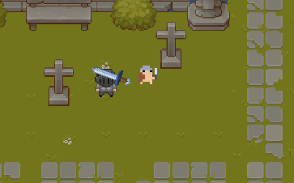
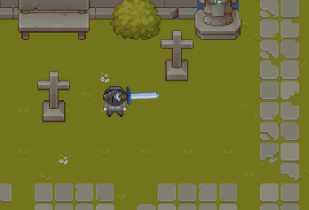

# RPG 2D - Królestwo Cieni

To jest gra RPG 2D, w której gracz wciela się w bohatera, który wyrusza na wyprawę, aby uratować swoje królestwo przed potworami. Gra zawiera eksplorację, walke oraz rozwój postaci.

### Funkcje:
- Eksploracja świata: Gracz przemierza różne lokacje, takie jak lasy, jaskinie i zamki.

- System walki z potworami.
  


- Historia: Interaktywna fabuła z dialogami.

## Technologie

### Silnik gry
- **Unity** - Silnik gier, który umożliwia tworzenie 2D i 3D gier. Używamy wersji Unity. Unity oferuje bogaty zestaw narzędzi, bibliotek i zasobów, umożliwiając szybkie prototypowanie oraz rozwój gier na wiele platform, takich jak PC, konsole, urządzenia mobilne czy przeglądarki internetowe. Dzięki intuicyjnemu edytorowi, obsłudze języka C#, wsparciu dla fizyki, animacji, systemów cząsteczkowych oraz integracji z popularnymi usługami (np. Ads, Analytics, multiplayer), Unity jest jedną z najczęściej wybieranych technologii do tworzenia zarówno gier niezależnych, jak i komercyjnych produkcji na dużą skalę. W naszym projekcie używamy aktualnej wersji Unity, aby zapewnić kompatybilność i wykorzystać najnowsze funkcje silnika.

### Język programowania
- **C#** - Język programowania używany do skryptów w grze. Unity używa C# do tworzenia logiki gry.

### Grafika
- **Adobe Photoshop / Aseprite** - Programy używane do tworzenia 2D sprite'ów, tekstur i tła w grze.

### Dźwięk
- **Audacity** - Program do edycji dźwięków.

### Zależności i narzędzia
- **Unity Asset Store** - Wykorzystane zasoby, takie jak pakiety dźwięków, grafik, czy animacji.
- **Cinemachine**  - Narzędzie Unity do tworzenia zaawansowanych kamer i śledzenia obiektów w grze.
- **TextMeshPro** - Narzędzie do wyświetlania zaawansowanego tekstu w Unity.
- **2D Sprite Renderer** - Używane do renderowania obrazów i animacji 2D w grze.
- **Box2D**  - Silnik fizyki 2D, który może być używany w grze do obsługi kolizji i fizyki obiektów.

### Inne technologie
- **GitHub** - Platforma do hostowania repozytorium i współpracy nad projektem.

### Platformy docelowe
- **Windows** - Gra stworzona z myślą o tej platformie.

##Paradygmat obiektowy

##Polimorfizm
```cssharp
private void MouseFollow()
    {
        Vector3 Pos= Input.mousePosition;
        Vector3 playerScreen = Camera.main.WorldToScreenPoint(playerMovement.transform.position);

        float angle = Mathf.Atan2(Pos.y, Pos.x) * Mathf.Rad2Deg;

        if(Pos.x < playerScreen.x)
        {
            activeWeapon.transform.rotation = Quaternion.Euler(0, -180, angle);
            weaponColider.transform.rotation = Quaternion.Euler(0, -180, 0);
        }
        else
        {
            activeWeapon.transform.rotation = Quaternion.Euler(0, 0, angle);
            weaponColider.transform.rotation = Quaternion.Euler(0, 0, 0);
        }
    }

## Instalacja

Aby zainstalować i uruchomić grę na swoim komputerze, wykonaj poniższe kroki:

1. Sklonuj repozytorium:
   ```bash
   git clone https://github.com/twoje-repozytorium/rpg-2d.git
   cd rpg-2d

2. Pobierz i zainstaluj Unity Hub: https://unity.com/download.

3. W Unity Hub dodaj projekt klikając Add i wybierz folder, w którym pobrałeś projekt.

4. Jeśli projekt wymaga zainstalowania dodatkowych pakietów, Unity automatycznie poprosi Cię o ich pobranie.

5. Otwórz projekt w Unity i kliknij Play, aby uruchomić grę w edytorze.

6. Aby zbudować grę, wybierz File → Build Settings, wybierz platformę, kliknij Switch Platform, a następnie kliknij Build.

## License

[MIT](https://choosealicense.com/licenses/mit/)
